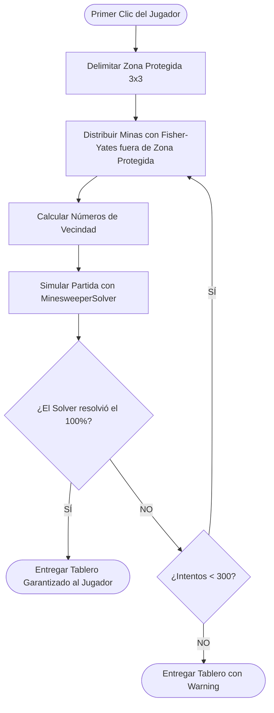

# Explicación: Algoritmo No-Guess y Solver Multinivel

*Navegación:* [Documentación Principal](../README.md) > **Explanation: Algoritmo No-Guess**

En los juegos clásicos de Buscaminas, los tableros se generan colocando minas al azar. Esta aproximación suele producir situaciones donde dos o más celdas tienen exactamente la misma probabilidad de contener una mina (conocidas como situaciones **50/50** o bloqueos de azar). En un juego de supervivencia roguelike, perder una partida por una decisión forzada al azar resulta frustrante e injusto.

Este documento explica en profundidad el diseño matemático y algorítmico utilizado por este proyecto para **garantizar tableros 100% resolubles por deducción lógica pura (No-Guess)**.

---

## Índice de Contenidos
- [1. Pipeline de Generación por Muestreo y Rechazo](#1-pipeline-de-generación-por-muestreo-y-rechazo)
- [2. El Motor de Resolución Multinivel (MinesweeperSolver)](#2-el-motor-de-resolución-multinivel-minesweepersolver)
  - [Nivel 1: Heurísticas Triviales de Vecindad](#nivel-1-heurísticas-triviales-de-vecindad)
  - [Nivel 2: Álgebra Lineal y Reducción Gauss-Jordan RREF](#nivel-2-álgebra-lineal-y-reducción-gauss-jordan-rref)
  - [Nivel 3: Componentes Conexas y Backtracking Local (Tank Solver)](#nivel-3-componentes-conexas-y-backtracking-local-tank-solver)
- [3. Resumen de Complejidad y Rendimiento](#3-resumen-de-complejidad-y-rendimiento)
- [Navegación y Enlaces Relacionados](#navegación-y-enlaces-relacionados)

---

## 1. Pipeline de Generación por Muestreo y Rechazo

En lugar de construir tableros complejos con heurísticas rígidas, el generador ([`BoardGenerator`](../../scripts/core/generacion-tablero/board_generator.gd)) implementa un esquema de **muestreo con rechazo asistido por simulación lógica**:

### Zona Protegida $3 \times 3$
Para asegurar que el jugador comience siempre con información útil y una apertura limpia:
1. La función [`BoardGenerator.get_protected_zone()`](../../scripts/core/generacion-tablero/board_generator.gd) define una ventana de $3 \times 3$ celdas centrada en la coordenada del primer clic.
2. Todas las celdas dentro de esta ventana quedan excluidas de la colocación de minas en [`BoardGenerator.populate_mines()`](../../scripts/core/generacion-tablero/board_generator.gd).
3. Esto garantiza que la celda inicial siempre tenga valor $0$ (ninguna mina vecina), desencadenando una apertura en cascada automática en [`BoardData.reveal()`](../../scripts/core/generacion-tablero/board_data.gd).

---

## 2. El Motor de Resolución Multinivel (`MinesweeperSolver`)
 
Para determinar si un tablero es solvable sin adivinar, [`MinesweeperSolver.solve()`](../../scripts/core/generacion-tablero/minesweeper_solver.gd) simula el proceso de pensamiento deductivo dividiéndolo en tres niveles de complejidad creciente estructurados en un **pipeline modular de deducción** (`Array[Callable]`). 

Para evitar duplicación de código y garantizar alta eficiencia, el solver centraliza el análisis de la frontera activa en estructuras fuertemente tipadas:
- `FrontierData`: Almacena el vector ordenado de celdas ocultas frontera y su diccionario de mapeo a variables.
- `FrontierConstraint`: Modela cada restricción numérica local ($A_i \mathbf{x} = b_i$) sin asignación de diccionarios efímeros.

Si en cualquier ciclo un nivel logra deducir al menos una celda segura o una mina segura, el solver reinicia la cascada desde el nivel más simple.
 
---
 
### Nivel 1: Heurísticas Triviales de Vecindad
 
Implementado en `MinesweeperSolver._apply_trivial_logic()`. Inspecciona cada celda revelada $(x, y)$ con valor numérico $N > 0$. Sean $H$ el conjunto de celdas vecinas ocultas y no marcadas, y $F$ el conjunto de celdas vecinas ya marcadas con boya:
 
$$\text{Minas Requeridas } R = N - |F|$$
 
1. **Regla de Saturación de Minas:** Si $R = |H|$, todas las celdas en $H$ son inequívocamente minas.
2. **Regla de Despeje Seguro:** Si $R = 0$, todas las celdas en $H$ son inequívocamente seguras para abrir.
 
---
 
### Nivel 2: Álgebra Lineal y Reducción Gauss-Jordan RREF
 
Implementado en `MinesweeperSolver._apply_gauss_jordan()`. Cuando las reglas triviales se agotan, existen patrones acoplados (como los clásicos $1-2-1$ o $1-2-2-1$) donde la información de múltiples números se superpone sobre la misma frontera de celdas ocultas extraída en `FrontierData`.
 
El solver modela la frontera como un **sistema de ecuaciones lineales con variables binarias**:
 
$$A \mathbf{x} = \mathbf{b}, \quad \text{donde } x_j \in \{0, 1\}$$
 
- Cada variable $x_j$ representa el estado de una celda oculta de la frontera ($0 = \text{segura}, 1 = \text{mina}$).
- Cada fila de la matriz $A$ representa una ecuación impuesta por un número revelado.
- El vector $\mathbf{b}$ almacena las minas restantes requeridas por cada número.
 
#### Reducción a Forma Escalonada Reducida por Filas (RREF)
La clase [`GaussJordanSolver.to_rref()`](../../scripts/core/generacion-tablero/gauss_jordan.gd) transforma la matriz aumentada $[A \mid \mathbf{b}]$ en su forma RREF mediante pivoteo parcial.
 
#### Extracción de Certezas Inequívocas (`find_certainties`)
La función [`GaussJordanSolver.find_certainties()`](../../scripts/core/generacion-tablero/gauss_jordan.gd) analiza cada fila en RREF con coeficientes $c_j$ y término independiente $b_i$:
 
$$\sum_{j} c_j x_j = b_i$$
 
Sean $P = \sum_{c_j > 0} c_j$ (suma de coeficientes positivos) y $N = \sum_{c_j < 0} c_j$ (suma de coeficientes negativos):
- Como $0 \le x_j \le 1$, el valor máximo que puede tomar el lado izquierdo es $P$ y el mínimo es $N$.
- **Certeza Máxima:** Si $b_i = P$, entonces todas las variables con coeficiente positivo deben ser $1$ (minas) y todas las variables con coeficiente negativo deben ser $0$ (seguras).
- **Certeza Mínima:** Si $b_i = N$, entonces todas las variables con coeficiente positivo deben ser $0$ (seguras) y todas las negativas deben ser $1$ (minas).
 
---
 
### Nivel 3: Componentes Conexas y Backtracking Local (Tank Solver)
 
Implementado en `MinesweeperSolver._apply_connected_components_backtracking()`. Para situaciones donde las ecuaciones lineales no determinan variables individuales de forma directa:
 
1. **Grafo de Adyacencia con Sets:** Se construye un grafo no dirigido indexado sobre conjuntos `Dictionary` (evitando búsquedas lineales $\mathcal{O}(N)$ con `Array.has()`).
2. **Segmentación en Componentes Conexas:** Mediante una búsqueda en anchura (BFS), se divide la frontera en subgrupos aislados e independientes.
3. **Búsqueda Exhaustiva con Poda Acumulativa (*Branch and Bound*):**
   - Para componentes de hasta $18$ variables (`MinesweeperSolver.MAX_COMPONENT_BACKTRACK_VARS`), se evalúan recursivamente las combinaciones $x_j \in \{0, 1\}$.
   - **Poda por saturación:** Si el acumulador numérico de minas `current_mines` supera el presupuesto global o local, la rama se descarta de inmediato sin evaluar arrays.
   - **Poda por déficit:** Si ni aun asignando minas en todas las variables restantes de una restricción se alcanza el total requerido, la rama se poda.
4. **Cálculo de Invariantes:**
   - Si una variable $x_k = 0$ en el $100\%$ de las configuraciones válidas encontradas $\implies$ La celda es $100\%$ segura.
   - Si una variable $x_k = 1$ en el $100\%$ de las configuraciones válidas encontradas $\implies$ La celda es $100\%$ una mina.
 
El resultado final se encapsula en [`SolverResult`](../../scripts/core/generacion-tablero/solver_result.gd).

---

## 3. Resumen de Complejidad y Rendimiento

| Técnica | Dominio | Complejidad Temporal | Casos Resueltos |
| :--- | :--- | :--- | :--- |
| **Nivel 1: Heurísticas Triviales** | Celdas individuales | $\mathcal{O}(N)$ | $\approx 70\%-80\%$ de los pasos |
| **Nivel 2: Gauss-Jordan RREF** | Frontera continua | $\mathcal{O}(R \cdot C^2)$ | $\approx 15\%-20\%$ de los pasos |
| **Nivel 3: Tank Backtracking** | Componentes aisladas | $\mathcal{O}(2^k)$ con $k \le 18$ | $\approx 5\%$ de los pasos más difíciles |

Gracias a este pipeline en cascada, la generación de tableros toma típicamente entre **$3$ y $15$ milisegundos** por tablero, asegurando una experiencia completamente fluida.

---

## Navegación y Enlaces Relacionados

- **API de clases involucradas:** [Referencia de API Core de Generación](../reference/api-core-tablero.md)
- **Suite de tests del algoritmo:** [`test_solver.gd`](../../test/unit/test_solver.gd) | [`test_gauss_jordan.gd`](../../test/unit/test_gauss_jordan.gd)
- **Aprender a testear el solver:** [Cómo Ejecutar y Crear Pruebas con GUT](../how-to/ejecutar-pruebas-gut.md)
- **Diseño del HUD táctico:** [Explicación de Arquitectura Visual y Consola CRT](arquitectura-visual-crt.md)
- **Volver al índice:** [Centro de Documentación (`docs/README.md`)](../README.md)
